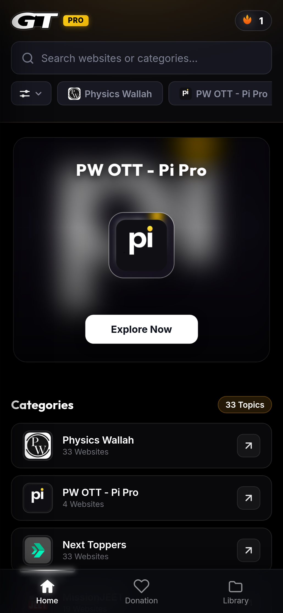
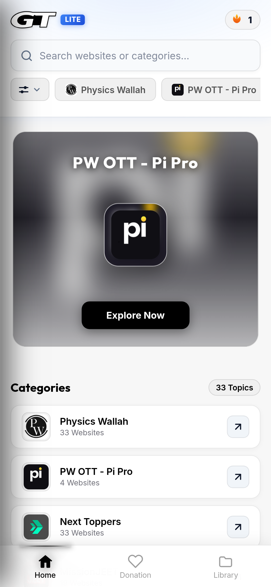
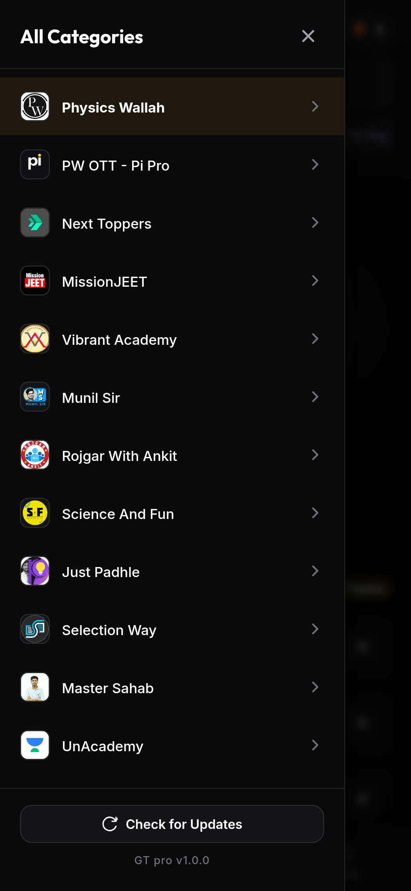
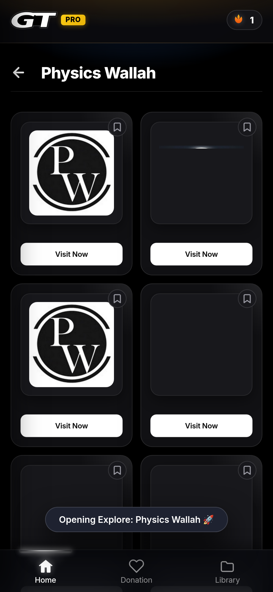
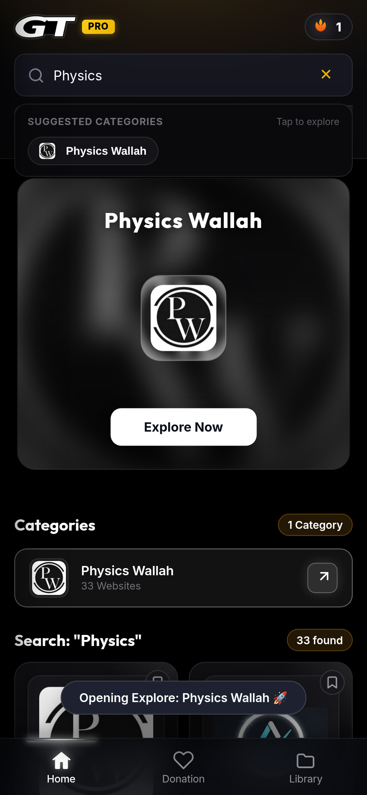
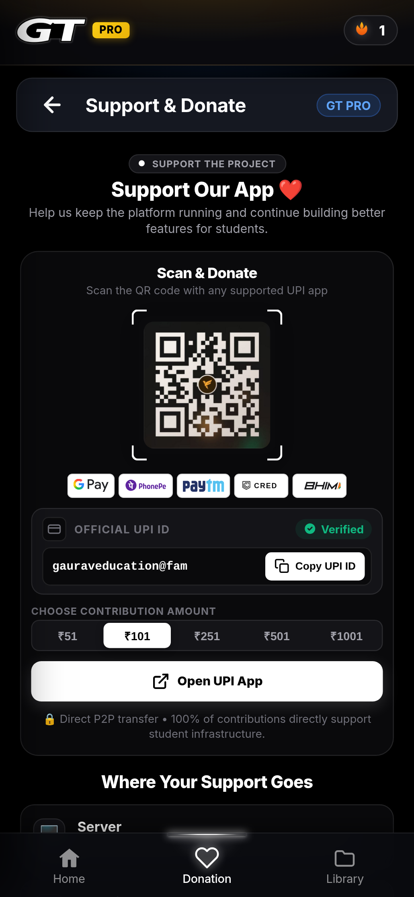
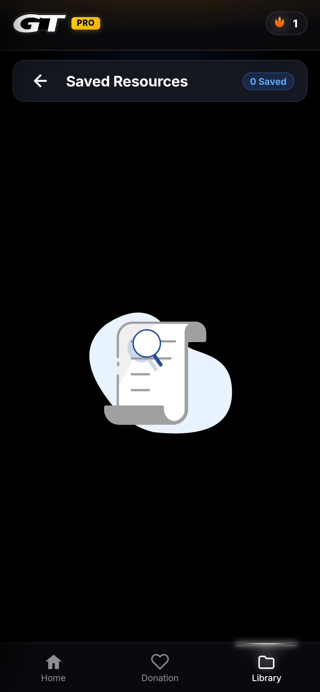
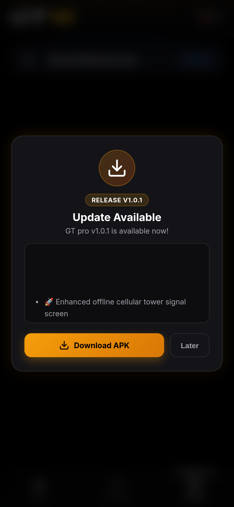
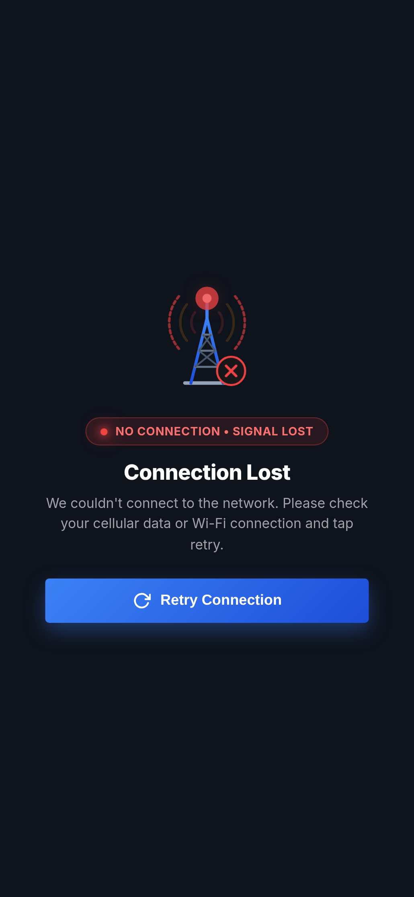
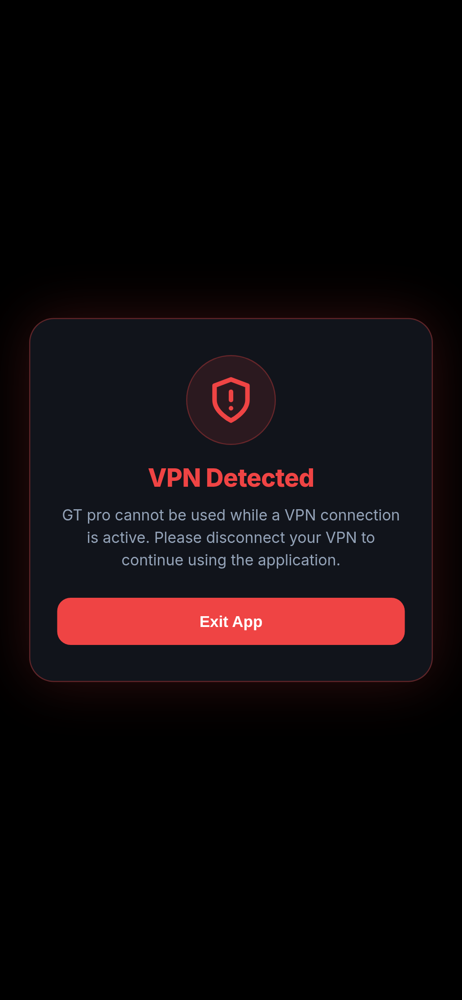

<p align="center">
  
</p>

<h1 align="center">GT pro (Study With Gaurav PRO)</h1>

<p align="center">
  <strong>Next-Generation Educational Learning Platform for Web & Android</strong><br>
  Engineered with Modern Web Standards (HTML5, Vanilla CSS, Modern JavaScript) and Native Capacitor Android Integration.
</p>

<p align="center">
  <a href="https://github.com/Gaurav1000m/GT-pro/actions/workflows/android-build.yml">
    
  </a>
  <a href="https://github.com/Gaurav1000m/GT-pro/releases">
    
  </a>
  
  
  
</p>

---

## 📑 Table of Contents

- [📱 Application Overview](#-application-overview)
- [📸 Application Screenshots](#-application-screenshots)
  - [1. Launch & Core Experience](#1-launch--core-experience)
  - [2. Discovery & Navigation](#2-discovery--navigation)
  - [3. Community Support & Library](#3-community-support--library)
  - [4. Security, Resilience & Updates](#4-security-resilience--updates)
- [✨ Key Features](#-key-features)
- [🛠️ Tech Stack & Architecture](#️-tech-stack--architecture)
- [🚀 Quick Start (Web Development)](#-quick-start-web-development)
- [🤖 Capacitor Android Build & Sync](#-capacitor-android-build--sync)
- [🔒 Security & VPN Detection](#-security--vpn-detection)
- [📡 Offline Transmission & Network Recovery](#-offline-transmission--network-recovery)
- [🔄 In-App Updates & Version Control](#-in-app-updates--version-control)
- [🐙 Git Workflow & Releases](#-git-workflow--releases)
- [📄 License](#-license)

---

## 📱 Application Overview

**GT pro** is a high-performance educational portal offering students streamlined access to top competitive exam portals (NDA, CDS, AFCAT, JEE, NEET, and more), live online lectures, notes, and study resources. It is engineered with:

- **Package ID**: `com.gt.pro`
- **Current Version**: `1.3.0`
- **Default Theme**: Sleek Dark OLED Mode with Dynamic Light/Dark switching
- **Cross-Platform**: Operates identically as an offline-capable Progressive Web Application (PWA) and an Android APK / AAB.

---

## 📸 Application Screenshots

Explore the visual design, micro-animations, and interface components across every major application screen:

### 1. Launch & Core Experience

| Splash Screen | Home Dashboard (Dark PRO) | Home Dashboard (Light LITE) |
| :---: | :---: | :---: |
|  |  |  |
| *Branded startup splash with ambient golden glow & PRO insignia* | *Hero carousel, quick category filter chips, and interactive cards* | *High-contrast daytime mode with adaptive LITE badge* |

---

### 2. Discovery & Navigation

| Category Sidebar Drawer | Explore Category Grid | Real-time Search Engine |
| :---: | :---: | :---: |
|  |  |  |
| *Slide-out category navigation with topic icons & update checker* | *Deep category view with visit links, bookmarks, and back button* | *Instant search with category suggestions & search chip badges* |

---

### 3. Community Support & Library

| Support & Donation Hub | Saved Resources & Library |
| :---: | :---: |
|  |  |
| *Unified UPI payment hub with QR scanner, amount tiers & copy button* | *Offline bookmark storage and animated zero-state illustration* |

---

### 4. Security, Resilience & Updates

| In-App Update Modal | Offline Connection Lost Screen | VPN Detected Security Modal |
| :---: | :---: | :---: |
|  |  |  |
| *GitHub Release API integration with automatic APK download link* | *Cellular transmission tower graphic with lost signal waves & retry button* | *Hardware & network tunnel security modal protecting app integrity* |

---

## ✨ Key Features

- 🌓 **Dynamic Theming Engine**: Seamlessly switch between the signature Dark OLED theme and the crisp Light theme by tapping the header logo.
- 🔍 **Predictive Search**: Live keystroke filtering with suggested category pills and instant match highlights.
- 📂 **Multi-Tiered Exploration**: Browse by exam tracks (NDA, CDS, AFCAT), featured carousels, or access the drawer for all 33+ curated topics.
- 💾 **Offline Bookmarking**: Save favourite platforms and lectures locally with zero latency and persist them in the Library.
- 🛡️ **Military-Grade VPN Shield**: Scans network interfaces (`tun0`, `ppp0`, `wg0`) and `TRANSPORT_VPN` to prevent unauthorized proxying.
- 📶 **Smart Connectivity Fallback**: Beautiful transmission tower animation detects lost connections and provides a 1-tap reconnect mechanism.
- 🔔 **Seamless In-App Updates**: Automatically queries GitHub Releases for newer builds and presents release notes directly within the app.
- 💖 **Native UPI Contribution Hub**: Integrated UPI intents (`gpay`, `phonepe`, `paytm`, `cred`, `bhim`), QR code scanner view, and verified UPI ID clipboard copy.

---

## 🛠️ Tech Stack & Architecture

```text
┌────────────────────────────────────────────────────────────┐
│                    GT pro Client App                       │
│                                                            │
│  ┌───────────────────────┐      ┌───────────────────────┐  │
│  │   Presentation Layer  │      │     Native Shell      │  │
│  │  • HTML5 Semantic UI  │      │  • Capacitor Core     │  │
│  │  • Vanilla CSS Tokens │ <──> │  • Status Bar Plugin  │  │
│  │  • ES6+ Vanilla JS    │      │  • App Lifecycle      │  │
│  │  • DotLottie Players  │      │  • Android Webview    │  │
│  └───────────────────────┘      └───────────────────────┘  │
│              │                               │             │
│              ▼                               ▼             │
│  ┌───────────────────────┐      ┌───────────────────────┐  │
│  │     Data & Cache      │      │    Native Security    │  │
│  │  • localStorage      │      │  • ConnectivityMgr    │  │
│  │  • GitHub API v3      │      │  • VPN Tunnel Checks  │  │
│  └───────────────────────┘      └───────────────────────┘  │
└────────────────────────────────────────────────────────────┘
```

- **Frontend**: HTML5, Vanilla CSS3 (Custom Design System, Flexbox/Grid, Glassmorphism, CSS Variables), Modern JavaScript (ES6+ Modules & Async/Await).
- **Mobile Hybrid Core**: Capacitor 8.5 (`@capacitor/android`, `@capacitor/app`, `@capacitor/browser`, `@capacitor/splash-screen`, `@capacitor/status-bar`).
- **Native Android**: Java 21, Gradle 8.14.3, Android SDK 34+.
- **CI/CD**: GitHub Actions automated pipeline with Keystore APK signing and GitHub Release attachments.

---

## 🚀 Quick Start (Web Development)

```bash
# 1. Clone the repository
git clone https://github.com/Gaurav1000m/GT-pro.git
cd GT-pro

# 2. Install dependencies
npm install

# 3. Start local development server
npm start
# Server boots at http://localhost:5500
```

---

## 🤖 Capacitor Android Build & Sync

### 1. Build and Sync Web Assets
```bash
# Compile and copy web distribution to Android assets
npm run cap:sync
```

### 2. Open Project in Android Studio
```bash
npm run cap:open
```

### 3. Build Binaries from Command Line
Ensure `android/local.properties` specifies your Android SDK directory:
```properties
sdk.dir=/path/to/android-sdk
```

```bash
# Build Debug APK
cd android
./gradlew assembleDebug
# Generated APK: android/app/build/outputs/apk/debug/app-debug.apk

# Build Release APK & App Bundle (AAB)
./gradlew assembleRelease bundleRelease
# Generated APK: android/app/build/outputs/apk/release/app-release-unsigned.apk
# Generated AAB: android/app/build/outputs/bundle/release/app-release.aab
```

---

## 🔒 Security & VPN Detection

GT pro enforces strict network integrity directly at the native Android runtime (`MainActivity.java`):

1. **Active Transport Inspection**:
   ```java
   NetworkCapabilities capabilities = cm.getNetworkCapabilities(activeNetwork);
   boolean isVpn = capabilities.hasTransport(NetworkCapabilities.TRANSPORT_VPN);
   ```
2. **Interface Enumeration**:
   Iterates through system network interfaces to detect virtual routing adapters (`tun`, `ppp`, `p2p`, `tap`, `wg`).
3. **Automated Defense**:
   If an active VPN is identified, a security modal is presented, an Android Toast `"Vpn Detected"` is dispatched, and `finishAffinity()` terminates the application to preserve network safety.

---

## 📡 Offline Transmission & Network Recovery

When network connectivity drops:
- A responsive overlay appears displaying an animated cellular transmission tower with active signal-loss waves.
- When the user taps **Retry Connection**, the application tests connectivity against native network APIs and restores the view automatically once online.

---

## 🔄 In-App Updates & Version Control

- The client queries `https://api.github.com/repos/Gaurav1000m/GT-pro/releases/latest` using semantic version comparison.
- When a new version (e.g., `v1.0.1`) is published on GitHub, a popup dialog notifies the user with release notes and a direct **Download APK** button.
- Users can manually check for updates anytime via the **Check for Updates** button in the sidebar drawer.

---

## 🐙 Git Workflow & Releases

### Branching Model
- `main`: Production-ready releases and release tags.
- `development`: Active feature development and testing.

```text
feature-branch ──> development ──> main ──> Release Tag (e.g., v1.0.0)
```

### Automated GitHub Actions Release
When creating a new release:
```bash
git tag v1.0.1
git push origin v1.0.1
```
The [android-build.yml](.github/workflows/android-build.yml) workflow will automatically build, sign the APK, and upload it as a release asset.

---

## 📄 License

This project is licensed under the **MIT License**. Created with ❤️ by Gaurav.
